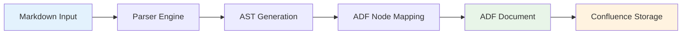
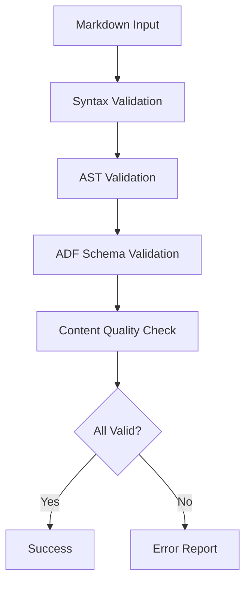

# ADF Conversion

Comprehensive guide to Atlassian Document Format (ADF) conversion in the MCP Confluence ADF system.

## Overview

The Atlassian Document Format (ADF) is a JSON-based format used by Confluence to store and render rich content. The MCP server handles automatic conversion between Markdown and ADF, enabling seamless content creation and editing.



## ADF Structure and Components

### Document Structure

ADF documents follow a hierarchical node structure:

```json
{
  "version": 1,
  "type": "doc",
  "content": [
    {
      "type": "paragraph",
      "content": [
        {
          "type": "text",
          "text": "Hello world",
          "marks": []
        }
      ]
    }
  ]
}
```

### Core Node Types

#### Text Nodes
```json
{
  "type": "text",
  "text": "Sample text content",
  "marks": [
    {
      "type": "strong"
    },
    {
      "type": "em"
    }
  ]
}
```

#### Paragraph Nodes
```json
{
  "type": "paragraph",
  "content": [
    {
      "type": "text",
      "text": "Paragraph content"
    }
  ]
}
```

#### Heading Nodes
```json
{
  "type": "heading",
  "attrs": {
    "level": 1
  },
  "content": [
    {
      "type": "text",
      "text": "Heading Text"
    }
  ]
}
```

## Markdown to ADF Mapping

### Basic Text Formatting

| Markdown | ADF Node | Description |
|----------|----------|-------------|
| `**bold**` | `text` with `strong` mark | Bold text |
| `*italic*` | `text` with `em` mark | Italic text |
| `` `code` `` | `text` with `code` mark | Inline code |
| `~~strike~~` | `text` with `strike` mark | Strikethrough |

### Headers

| Markdown | ADF Structure |
|----------|---------------|
| `# H1` | `heading` level 1 |
| `## H2` | `heading` level 2 |
| `### H3` | `heading` level 3 |
| `#### H4` | `heading` level 4 |
| `##### H5` | `heading` level 5 |
| `###### H6` | `heading` level 6 |

**ADF Example:**
```json
{
  "type": "heading",
  "attrs": {
    "level": 1
  },
  "content": [
    {
      "type": "text",
      "text": "Main Heading"
    }
  ]
}
```

### Lists

#### Unordered Lists
**Markdown:**
```markdown
- Item 1
- Item 2
  - Nested item
```

**ADF:**
```json
{
  "type": "bulletList",
  "content": [
    {
      "type": "listItem",
      "content": [
        {
          "type": "paragraph",
          "content": [
            {
              "type": "text",
              "text": "Item 1"
            }
          ]
        }
      ]
    }
  ]
}
```

#### Ordered Lists
**Markdown:**
```markdown
1. First item
2. Second item
```

**ADF:**
```json
{
  "type": "orderedList",
  "content": [
    {
      "type": "listItem",
      "content": [
        {
          "type": "paragraph",
          "content": [
            {
              "type": "text",
              "text": "First item"
            }
          ]
        }
      ]
    }
  ]
}
```

### Code Blocks

**Markdown:**
```markdown
```javascript
function example() {
  return "hello";
}
```
```

**ADF:**
```json
{
  "type": "codeBlock",
  "attrs": {
    "language": "javascript"
  },
  "content": [
    {
      "type": "text",
      "text": "function example() {\n  return \"hello\";\n}"
    }
  ]
}
```

### Links

**Markdown:**
```markdown
[Link text](https://example.com)
```

**ADF:**
```json
{
  "type": "text",
  "text": "Link text",
  "marks": [
    {
      "type": "link",
      "attrs": {
        "href": "https://example.com"
      }
    }
  ]
}
```

## Advanced ADF Components

### Panels (Callouts)

Panels are special ADF components for highlighting information.

#### Info Panel
**Markdown:**
```markdown
> **Info:** This is important information
```

**ADF:**
```json
{
  "type": "panel",
  "attrs": {
    "panelType": "info"
  },
  "content": [
    {
      "type": "paragraph",
      "content": [
        {
          "type": "text",
          "text": "This is important information"
        }
      ]
    }
  ]
}
```

#### Warning Panel
**Markdown:**
```markdown
> **Warning:** This requires attention
```

**ADF:**
```json
{
  "type": "panel",
  "attrs": {
    "panelType": "warning"
  },
  "content": [
    {
      "type": "paragraph",
      "content": [
        {
          "type": "text",
          "text": "This requires attention"
        }
      ]
    }
  ]
}
```

#### Success Panel
**Markdown:**
```markdown
> **Success:** Operation completed successfully
```

**ADF:**
```json
{
  "type": "panel",
  "attrs": {
    "panelType": "success"
  },
  "content": [
    {
      "type": "paragraph",
      "content": [
        {
          "type": "text",
          "text": "Operation completed successfully"
        }
      ]
    }
  ]
}
```

#### Note Panel
**Markdown:**
```markdown
> **Note:** Additional context
```

**ADF:**
```json
{
  "type": "panel",
  "attrs": {
    "panelType": "note"
  },
  "content": [
    {
      "type": "paragraph",
      "content": [
        {
          "type": "text",
          "text": "Additional context"
        }
      ]
    }
  ]
}
```

### Expandable Content (Expand)

**Markdown:**
```markdown
<details>
<summary><strong>Advanced Options</strong></summary>

Detailed configuration information here.

</details>
```

**ADF:**
```json
{
  "type": "expand",
  "attrs": {
    "title": "Advanced Options"
  },
  "content": [
    {
      "type": "paragraph",
      "content": [
        {
          "type": "text",
          "text": "Detailed configuration information here."
        }
      ]
    }
  ]
}
```

### Tables

**Markdown:**
```markdown
| Header 1 | Header 2 |
|----------|----------|
| Cell 1   | Cell 2   |
```

**ADF:**
```json
{
  "type": "table",
  "attrs": {
    "isNumberColumnEnabled": false,
    "layout": "default"
  },
  "content": [
    {
      "type": "tableRow",
      "content": [
        {
          "type": "tableHeader",
          "attrs": {},
          "content": [
            {
              "type": "paragraph",
              "content": [
                {
                  "type": "text",
                  "text": "Header 1"
                }
              ]
            }
          ]
        },
        {
          "type": "tableHeader",
          "attrs": {},
          "content": [
            {
              "type": "paragraph",
              "content": [
                {
                  "type": "text",
                  "text": "Header 2"
                }
              ]
            }
          ]
        }
      ]
    }
  ]
}
```

## Conversion Process

### 1. Markdown Parsing

The conversion process begins with parsing Markdown input:

```typescript
interface MarkdownParser {
  parse(markdown: string): MarkdownAST;
  validate(ast: MarkdownAST): ValidationResult;
}
```

**Parsing Steps:**
1. **Tokenization**: Break Markdown into tokens
2. **AST Generation**: Create Abstract Syntax Tree
3. **Validation**: Check for supported elements
4. **Preprocessing**: Handle custom syntax extensions

### 2. AST to ADF Mapping

Transform the Markdown AST into ADF nodes:

```typescript
interface ADF_Converter {
  convert(ast: MarkdownAST): ADFDocument;
  mapNode(node: MarkdownNode): ADFNode;
  applyMarks(text: string, marks: MarkdownMark[]): ADFText;
}
```

**Mapping Algorithm:**
```typescript
function convertNode(markdownNode: MarkdownNode): ADFNode {
  switch (markdownNode.type) {
    case 'heading':
      return createHeadingNode(markdownNode);
    case 'paragraph':
      return createParagraphNode(markdownNode);
    case 'codeBlock':
      return createCodeBlockNode(markdownNode);
    case 'panel':
      return createPanelNode(markdownNode);
    default:
      throw new Error(`Unsupported node type: ${markdownNode.type}`);
  }
}
```

### 3. ADF Document Assembly

Combine individual nodes into a complete ADF document:

```json
{
  "version": 1,
  "type": "doc",
  "content": [
    // Array of converted ADF nodes
  ]
}
```

### 4. Validation and Optimization

**Validation Checks:**
- Schema compliance
- Node relationship validity
- Content integrity
- Size limitations

**Optimization Steps:**
- Remove redundant nodes
- Merge adjacent text nodes
- Optimize mark application
- Compress whitespace

## Custom Markdown Extensions

### Panel Syntax

The system supports custom Markdown syntax for Confluence panels:

```markdown
~~~panel type=info title="Information"
Content goes here
~~~
```

**Conversion Process:**
1. Parse custom fence syntax
2. Extract panel type and title attributes
3. Generate ADF panel node
4. Process panel content recursively

### Expandable Syntax

Enhanced support for expandable sections:

```markdown
:::expand title="Click to expand"
Hidden content here
:::
```

### Status Macros

Convert status indicators to Confluence status macros:

```markdown
status:complete "Task finished"
status:in-progress "Work ongoing"
status:todo "Not started"
```

**ADF Output:**
```json
{
  "type": "status",
  "attrs": {
    "text": "Task finished",
    "color": "green",
    "localId": "uuid"
  }
}
```

## Error Handling

### Common Conversion Errors

#### Unsupported Markdown Elements
```
Error: Markdown element 'custom_block' not supported in ADF conversion
Solution: Use supported Markdown syntax or custom extensions
```

#### Invalid Panel Syntax
```
Error: Panel type 'custom' not recognized
Supported: info, warning, success, note, error
```

#### Malformed Tables
```
Error: Table structure invalid - missing header separator
Fix: Ensure tables have proper header separator: |---|---|
```

### Error Recovery Strategies

**Graceful Degradation:**
```typescript
function handleUnsupportedElement(element: MarkdownElement): ADFNode {
  // Convert to paragraph with warning
  return {
    type: 'paragraph',
    content: [
      {
        type: 'text',
        text: `[Unsupported element: ${element.type}]`,
        marks: [{ type: 'em' }]
      }
    ]
  };
}
```

**Content Preservation:**
- Maintain original text content
- Add conversion warnings
- Provide manual editing suggestions
- Log issues for review

## Performance Optimization

### Conversion Speed

**Optimization Strategies:**
1. **Streaming Processing**: Process large documents in chunks
2. **Caching**: Cache frequently converted patterns
3. **Parallel Processing**: Convert independent sections concurrently
4. **Lazy Loading**: Defer complex node processing

**Performance Metrics:**
```typescript
interface ConversionMetrics {
  inputSize: number;
  outputSize: number;
  conversionTime: number;
  nodeCount: number;
  errorCount: number;
}
```

### Memory Management

**Memory Optimization:**
- Process documents in streaming fashion
- Release AST memory after conversion
- Use object pooling for frequently created nodes
- Implement garbage collection hints

## Quality Assurance

### Conversion Validation

**Multi-level Validation:**


**Validation Layers:**
1. **Markdown Syntax**: Valid Markdown structure
2. **AST Integrity**: Well-formed abstract syntax tree
3. **ADF Schema**: Compliant ADF document structure
4. **Content Quality**: Meaningful, complete content

### Testing Strategy

**Automated Tests:**
```typescript
describe('ADF Conversion', () => {
  test('converts basic markdown to ADF', () => {
    const markdown = '# Heading\n\nParagraph text';
    const adf = convertMarkdownToADF(markdown);
    expect(adf.content[0].type).toBe('heading');
    expect(adf.content[1].type).toBe('paragraph');
  });
});
```

**Test Categories:**
- Unit tests for individual node conversion
- Integration tests for complete document conversion
- Performance tests for large documents
- Regression tests for known issues

## Integration with Extended Markdown ADF Parser

### Library Integration

The MCP server integrates with the `extended-markdown-adf-parser` library for robust conversion:

```typescript
import { convertMarkdownToADF, convertADFToMarkdown } from 'extended-markdown-adf-parser';

// Markdown to ADF
const adfDocument = await convertMarkdownToADF(markdownContent, {
  enableExtensions: true,
  validateOutput: true
});

// ADF to Markdown  
const markdownContent = await convertADFToMarkdown(adfDocument, {
  preservePanels: true,
  includeMetadata: false
});
```

### Configuration Options

**Conversion Settings:**
```typescript
interface ConversionOptions {
  enableExtensions: boolean;        // Enable custom markdown extensions
  validateOutput: boolean;          // Validate ADF output
  preserveComments: boolean;        // Keep HTML comments
  strictMode: boolean;              // Strict markdown parsing
  maxDepth: number;                 // Maximum nesting depth
  customNodeHandlers: NodeHandler[];// Custom node conversion handlers
}
```

### Extension Points

**Custom Node Handlers:**
```typescript
const customHandler: NodeHandler = {
  type: 'custom_block',
  handler: (node: MarkdownNode): ADFNode => {
    return {
      type: 'panel',
      attrs: { panelType: 'info' },
      content: convertContent(node.content)
    };
  }
};
```

## Troubleshooting Guide

### Diagnosis Tools

**Conversion Debug Mode:**
```bash
LOG_LEVEL=debug node mcp-server.js
```

**Debug Information:**
- Markdown parsing steps
- AST structure
- Node conversion process
- ADF validation results
- Error stack traces

### Common Issues and Solutions

#### Content Loss During Conversion
**Symptoms:** Missing text or formatting in converted content
**Diagnosis:** Check for unsupported Markdown elements
**Solution:** Use supported syntax or custom extensions

#### ADF Schema Violations
**Symptoms:** Confluence rejects the ADF document
**Diagnosis:** Validate ADF structure against schema
**Solution:** Fix node relationships and attributes

#### Performance Issues
**Symptoms:** Slow conversion for large documents  
**Diagnosis:** Monitor conversion metrics and memory usage
**Solution:** Enable streaming mode or split large documents

#### Panel Conversion Errors
**Symptoms:** Panels not rendering correctly in Confluence
**Diagnosis:** Check panel syntax and type attributes
**Solution:** Use standard panel types and proper formatting

### Recovery Procedures

**Partial Conversion Recovery:**
```typescript
function recoverFromConversionError(
  markdown: string, 
  error: ConversionError
): Partial<ADFDocument> {
  // Attempt conversion of valid sections
  const safeSections = splitIntoSafeSections(markdown);
  const convertedSections = safeSections
    .map(section => tryConvertSection(section))
    .filter(result => result.success);
  
  return combinePartialResults(convertedSections);
}
```

## Best Practices

### Markdown Authoring

**For Optimal Conversion:**
- Use standard Markdown syntax when possible
- Leverage supported panel syntax for rich content
- Test conversion with sample content
- Validate ADF output before publishing

**Formatting Guidelines:**
- Use consistent heading hierarchy
- Properly format code blocks with language tags
- Structure tables with clear headers
- Use semantic markup for emphasis

### Content Organization

**Document Structure:**
- Start with clear headings
- Use panels for important information
- Group related content logically
- Include navigation elements

**Rich Content Usage:**
- Info panels for helpful tips
- Warning panels for critical information
- Success panels for positive outcomes
- Note panels for additional context

### Performance Considerations

**Large Document Handling:**
- Split very large documents into sections
- Use streaming conversion when available
- Monitor memory usage during conversion
- Cache frequently converted content

## Future Enhancements

### Planned Features

1. **Enhanced Extensions**
   - Support for more Confluence macros
   - Custom block type definitions
   - Advanced table features

2. **Performance Improvements**
   - Streaming conversion for large documents
   - Parallel processing optimization
   - Enhanced caching strategies

3. **Quality Enhancements**
   - Better error recovery
   - Content quality scoring
   - Automated content suggestions

4. **Integration Features**
   - Direct Confluence macro support
   - Enhanced media handling
   - Real-time conversion preview

## Next Steps

- **[Template System](./template-system.md)** - Using templates with ADF conversion
- **[Error Handling](./error-handling.md)** - Comprehensive error handling guide
- **[Confluence Content Tools](./confluence-content-tools.md)** - Working with Confluence content
- **[Template Process Flow](./template-process-flow.md)** - Understanding the complete workflow