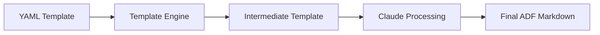
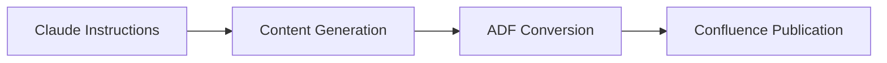

# Claude Template Generation Guide

A comprehensive guide on using Claude to generate structured templates for Confluence documentation.

## Overview

The MCP Confluence ADF server includes a powerful template system that enables Claude to generate structured, AI-processable documentation templates. This two-phase approach ensures consistent, high-quality documentation while leveraging Claude's natural language processing capabilities.

## The Template Generation Process

### Phase 1: YAML Template → Intermediate Template
**Human creates** → **System generates** → **Claude processes**



### Phase 2: Intermediate Template → Final Documentation  
**Claude processes** → **System converts** → **Confluence publishes**



## Understanding the Template Workflow

### 1. Template Structure Overview

**YAML Template Format:**
```yaml
---
# Template Metadata
name: "Template Name"
description: "What this template creates"
version: "1.0.0"
category: "user-guide"
sections: ["intro", "setup", "examples"]

# User Context (optional)
user_context_required:
  project_name: "What is your project name?"
  api_version: "What API version?"
---

# Template Structure
structure:
  - "# {{project_name}} Documentation"
  - type: info_panel
    title: "Overview" 
    content_instruction: "Describe the project's purpose"
  - section: "Getting Started"
    content_instruction: "Provide setup instructions"
```

**Generated Intermediate Template:**
```markdown
<!-- INTERMEDIATE TEMPLATE - FOR CLAUDE PROCESSING -->
<!-- Template: Template Name v1.0.0 -->
<!-- Category: user-guide -->

# {{project_name}} Documentation

> ℹ️ **Overview**
<!-- CLAUDE INSTRUCTION: REPLACE THIS COMMENT WITH CONTENT -->
<!-- TASK: Describe the project's purpose -->
<!-- ADF FORMATTING OPTIONS: -->
<!-- ~~~panel type=info title="Overview" -->
<!-- Content here -->
<!-- ~~~ -->

## Getting Started
<!-- CLAUDE INSTRUCTION: REPLACE THIS COMMENT WITH CONTENT -->
<!-- TASK: Provide setup instructions -->
```

## How to Use Templates with Claude

### Step 1: List Available Templates

```
Show me all available templates
```

**Claude Response:**
```
📋 Available Templates

## User Guide
- simple-getting-started: Basic getting started template
- user-guide-basic: Comprehensive user guide template

## API Documentation  
- api-documentation-modular: Modular API documentation
- technical-specification: Technical specification template

## Quick Start
- quick-start-guide: Quick start guide template
```

### Step 2: Generate an Intermediate Template

```
Generate documentation using the "simple-getting-started" template for my React component library called "UIKit Pro"
```

**Claude Response:**
```
✅ Intermediate Template Generated Successfully

📄 YAML Template: simple-getting-started
📁 Output Path: templates/generated/simple-getting-started-20241201-123456.md
🔍 Validation: Valid

🔄 Next Step: This intermediate template contains Claude instruction comments that need to be processed.

Workflow:
1. ✅ YAML template → Intermediate template (COMPLETED)
2. 🔄 Claude processes instructions → Final ADF markdown (NEXT)  
3. 📤 Upload to Confluence (FINAL)
```

### Step 3: Process the Intermediate Template

Claude automatically processes the generated intermediate template by:

1. **Reading the template file**
2. **Understanding the instructions**
3. **Generating appropriate content**
4. **Replacing instruction comments with real content**

**Example Processing:**

**Before (Intermediate):**
```markdown
> ℹ️ **Welcome**
<!-- CLAUDE INSTRUCTION: REPLACE THIS COMMENT WITH CONTENT -->
<!-- TASK: Create a welcoming introduction for UIKit Pro -->
<!-- PURPOSE: Set positive tone and provide overview -->
```

**After (Claude Processing):**
```markdown
> ℹ️ **Welcome**
Welcome to UIKit Pro! This comprehensive React component library provides 50+ professionally designed components to accelerate your development workflow. Built with TypeScript and fully customizable, UIKit Pro helps you create beautiful, accessible user interfaces in minutes instead of hours.
```

### Step 4: Create Confluence Page

```
Create a new page in the DOCS space with this generated content
```

**Claude automatically:**
1. Converts the Markdown to ADF format
2. Creates the Confluence page
3. Applies proper formatting for panels, code blocks, etc.
4. Returns the page URL for review

## Template Components Reference

### Basic Elements

#### Headers
```yaml
structure:
  - "# Main Title"
  - "## Section Header" 
  - "### Subsection"
```

#### Paragraphs
```yaml
structure:
  - "Regular paragraph text with **bold** and *italic* formatting."
  - "Another paragraph with [links](https://example.com)."
```

### ADF Panel Components

#### Info Panels
```yaml
- type: info_panel
  title: "Information Title"
  content_instruction: "What content should go here"
  purpose: "Why this panel is needed"
```

**Generates:**
```markdown
> ℹ️ **Information Title**
<!-- CLAUDE INSTRUCTION: REPLACE THIS COMMENT WITH CONTENT -->
<!-- TASK: What content should go here -->
<!-- PURPOSE: Why this panel is needed -->
```

#### Warning Panels
```yaml
- type: warning_panel
  title: "Security Notice"
  content_instruction: "Document security considerations"
```

**Generates:**
```markdown
> ⚠️ **Security Notice**  
<!-- CLAUDE INSTRUCTION: REPLACE THIS COMMENT WITH CONTENT -->
<!-- TASK: Document security considerations -->
```

#### Success Panels
```yaml
- type: success_panel
  title: "Setup Complete"
  content_instruction: "Congratulate user on completion"
```

#### Note Panels
```yaml
- type: note_panel
  title: "Additional Notes"
  content_instruction: "Provide supplementary information"
```

### Code Block Components

```yaml
- type: code_block
  language: "javascript"
  title: "Example Function"
  content_instruction: "Show a practical code example"
  purpose: "Help users understand implementation"
```

**Generates:**
```markdown
**Example Function**
```javascript
<!-- CLAUDE INSTRUCTION: REPLACE THIS COMMENT WITH CONTENT -->
<!-- TASK: Show a practical code example -->
<!-- PURPOSE: Help users understand implementation -->
```

**Supported Languages:** `bash`, `javascript`, `typescript`, `python`, `java`, `json`, `yaml`, `sql`, `html`, `css`, `curl`

### Expandable Sections

```yaml
- type: expandable
  title: "Advanced Configuration"
  content_instruction: "Document complex settings"
  collapsed_by_default: true
```

**Generates:**
```markdown
<details>
<summary><strong>Advanced Configuration</strong></summary>

<!-- CLAUDE INSTRUCTION: REPLACE THIS COMMENT WITH CONTENT -->
<!-- TASK: Document complex settings -->

</details>
```

### Section Components

```yaml
- section: "Getting Started"
  description: "Initial setup guide"
  content_instruction: "Provide step-by-step instructions"
  purpose: "Help new users get started quickly"
```

**Generates:**
```markdown
## Getting Started
<!-- Section: Getting Started -->
<!-- Description: Initial setup guide -->
<!-- CLAUDE INSTRUCTION: REPLACE THIS COMMENT WITH CONTENT -->
<!-- TASK: Provide step-by-step instructions -->
<!-- PURPOSE: Help new users get started quickly -->
```

## User Context System

### Defining Context Requirements

```yaml
user_context_required:
  project_name: "What is your project name?"
  main_technology: "What technology stack are you using?"
  api_version: "What API version are you documenting?"
  target_audience: "Who is your target audience?"
```

### Using Context in Templates

```yaml
structure:
  - "# {{project_name}} Documentation"
  - "## {{main_technology}} Implementation Guide"  
  - section: "API Version {{api_version}}"
    content_instruction: "Document features specific to {{api_version}}"
```

### Providing Context to Claude

When generating templates, provide context directly:

```
Generate documentation using "api-documentation" template with:
- project_name: "Payment Gateway API"
- main_technology: "Node.js"
- api_version: "v2.1"
- target_audience: "Backend developers"
```

## Advanced Template Features

### Conditional Content

```yaml
- section: "{{main_technology}} Setup"
  description: "Technology-specific setup instructions"
  content_instruction: "Provide {{main_technology}}-specific installation and configuration steps"
```

### Contextual ADF Suggestions

The template engine provides intelligent ADF formatting suggestions based on content keywords:

**Security-related content:**
- Suggests `warning_panel` for security notices
- Recommends `note_panel` for security best practices

**Code-related content:**
- Suggests appropriate code block languages
- Recommends `expandable` sections for complex examples

**Configuration content:**
- Suggests `expandable` sections for advanced settings
- Recommends `info_panel` for important configuration notes

## Best Practices

### 1. Template Design Principles

**Clear Instructions:**
```yaml
# Good
content_instruction: "Provide step-by-step installation instructions with code examples and verification steps"

# Less effective  
content_instruction: "Add installation info"
```

**Purposeful Components:**
```yaml
# Good
type: warning_panel
title: "Breaking Changes"
content_instruction: "Document API changes that require code updates"
purpose: "Prevent user confusion and breaking deployments"

# Less effective
type: info_panel  
title: "Changes"
content_instruction: "List changes"
```

### 2. Content Organization

**Logical Flow:**
```yaml
structure:
  - "# Main Title"
  - type: info_panel
    title: "Overview"
  - "## Prerequisites" 
  - "## Installation"
  - "## Basic Usage"
  - "## Advanced Features"
  - type: expandable
    title: "Troubleshooting"
```

**Progressive Disclosure:**
```yaml
- "## Basic Setup"
- section: "Quick Start"
  content_instruction: "Show the simplest possible example"
- type: expandable
  title: "Advanced Configuration"
  content_instruction: "Document complex scenarios"
```

### 3. User Context Strategy

**Essential Context Only:**
```yaml
user_context_required:
  project_name: "What is your project name?"
  main_language: "What programming language? (JavaScript, Python, etc.)"
```

**Context Validation:**
```yaml
# Use descriptive prompts
user_context_required:
  deployment_env: "What deployment environment? (development, staging, production)"
  auth_method: "What authentication method? (API key, OAuth, JWT)"
```

## Troubleshooting Template Generation

### Common Issues

#### Missing User Context
**Error:** `Template requires user context but none provided`

**Solution:**
```
Generate using "template-name" with project_name="My Project" and api_version="v1.0"
```

#### Invalid Template Structure  
**Error:** `Template validation failed: missing required fields`

**Check:** Ensure YAML frontmatter includes required fields:
```yaml
---
name: "Template Name"        # Required
description: "Description"   # Required  
version: "1.0.0"            # Required
category: "user-guide"      # Required
---
```

#### Template Not Found
**Error:** `Template 'template-name' not found`

**Solution:** List available templates first:
```
Show me all available templates
```

### Validation Tips

1. **Check Template Syntax**: Ensure valid YAML syntax
2. **Verify Context Variables**: Match variable names exactly: `{{project_name}}`
3. **Test Generation**: Generate without context first to check structure
4. **Review Instructions**: Ensure content_instruction fields are clear and actionable

## Creating Custom Templates

### Template File Structure

1. **Save as YAML**: Use `.yml` or `.yaml` extension
2. **Place in templates/yaml/**: Template engine searches this directory
3. **Follow naming convention**: Use kebab-case: `my-custom-template.yml`

### Example Custom Template

```yaml
---
name: "Custom API Guide"
description: "Custom template for API documentation"
version: "1.0.0"
category: "api"
sections: ["authentication", "endpoints", "examples"]
user_context_required:
  api_name: "What is your API name?"
  base_url: "What is the base URL?"
---
structure:
  - "# {{api_name}} API Reference"
  
  - type: info_panel
    title: "Base URL"
    content_instruction: "Document the base URL: {{base_url}}"
  
  - "## Authentication"
  - section: "API Key Setup"
    content_instruction: "Explain how to obtain and use API keys for {{api_name}}"
  
  - "## Endpoints"
  - section: "Core Endpoints"
    content_instruction: "Document the main API endpoints with examples"
    
  - type: code_block
    language: "curl"
    title: "Example Request"
    content_instruction: "Show a real API call to {{base_url}}"
    
  - type: expandable
    title: "Error Handling"
    content_instruction: "Document error codes and responses"
```

### Testing Custom Templates

```
Generate documentation using "custom-api-guide" template with api_name="Payment API" and base_url="https://api.payments.com/v1"
```

## Integration with Claude Code Workflows

### Automated Documentation Generation

```
# Generate multiple templates for a project
Generate these templates for "E-commerce API":
1. API documentation template
2. Getting started guide  
3. Integration examples

Then create Confluence pages for each in the DOCS space
```

### Content Updates

```
# Update existing documentation using templates
Update the "Payment API" documentation page using the latest API template with current endpoints and examples
```

### Batch Operations

```  
# Process multiple templates
For each service in our microservices architecture, generate API documentation using the standard template, then create Confluence pages in their respective spaces
```

## Next Steps

- **[Template System](./template-system.md)** - Deep dive into template architecture
- **[Custom Templates](./custom-templates.md)** - Advanced template creation
- **[Claude Code Workflows](./claude-code-workflows.md)** - Integration patterns
- **[ADF Conversion](./adf-conversion.md)** - Understanding the conversion process