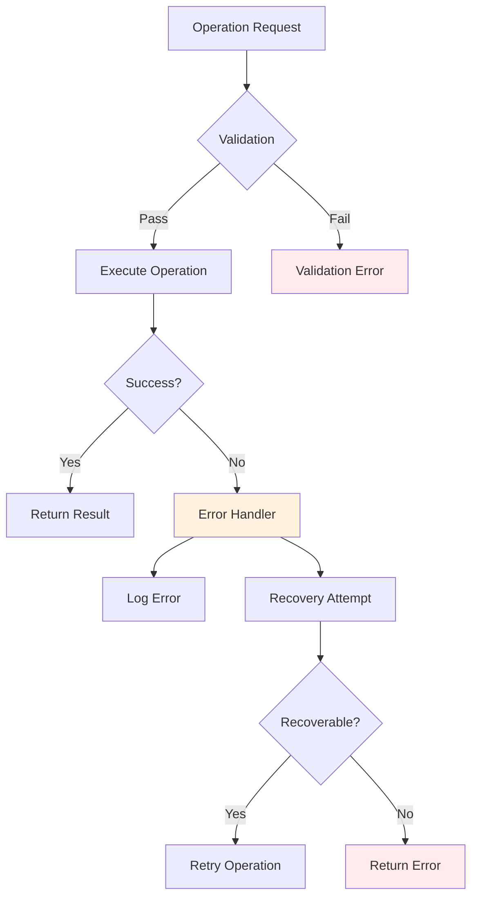
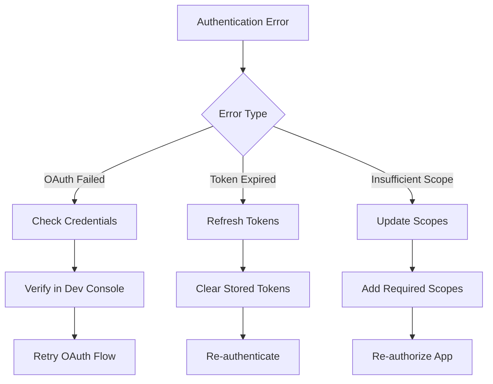
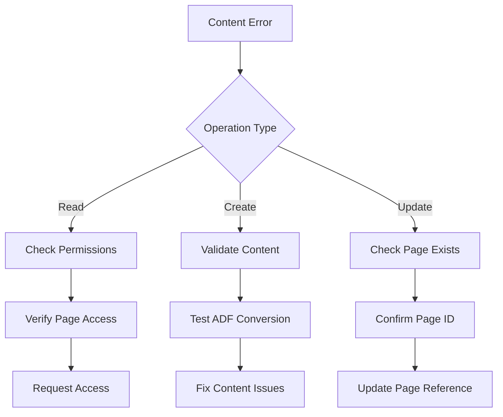
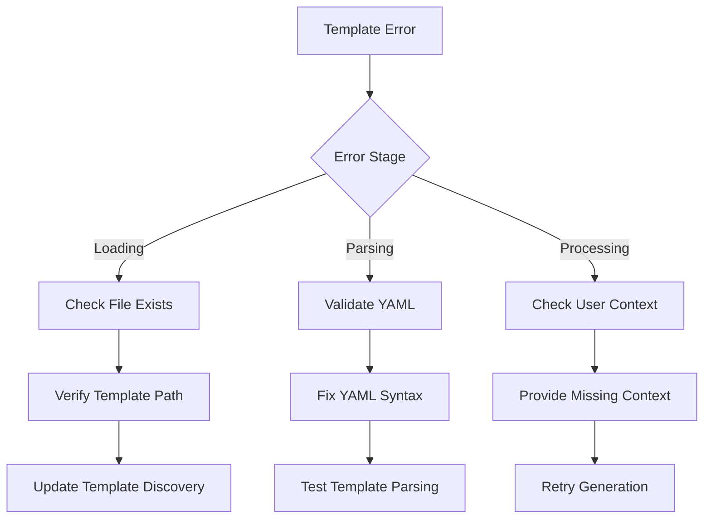

# Error Handling

Comprehensive guide to error handling, troubleshooting, and debugging in the MCP Confluence ADF system.

## Overview

The MCP Confluence ADF server implements robust error handling across all operations, providing clear error messages, automatic recovery mechanisms, and comprehensive troubleshooting tools.



## Error Categories

### 1. Authentication Errors

#### OAuth Authentication Failed
**Error Code:** `AUTH_OAUTH_FAILED`
**Description:** OAuth authentication process failed
**Common Causes:**
- Invalid client credentials
- Expired authorization codes
- Network connectivity issues
- Incorrect redirect URI

**Example:**
```json
{
  "error": "AUTH_OAUTH_FAILED",
  "message": "OAuth authentication failed: invalid_client",
  "details": {
    "clientId": "abc123...",
    "redirectUri": "http://localhost:9000/oauth/callback",
    "timestamp": "2024-01-15T10:30:00Z"
  },
  "recovery": {
    "action": "retry_oauth_flow",
    "instructions": "Verify client credentials in Developer Console"
  }
}
```

**Recovery Actions:**
1. Verify client ID and secret in Atlassian Developer Console
2. Check redirect URI matches exactly
3. Ensure all required OAuth scopes are granted
4. Retry OAuth initialization process

#### Token Expired
**Error Code:** `AUTH_TOKEN_EXPIRED`
**Description:** Access token has expired and refresh failed
**Common Causes:**
- Refresh token expired (90 days inactive)
- Token revoked by user
- Refresh token invalid

**Recovery Actions:**
```bash
# Clear stored tokens and re-authenticate
Clear Confluence authentication
Set up OAuth authentication again
```

#### Insufficient Permissions
**Error Code:** `AUTH_INSUFFICIENT_SCOPE`
**Description:** Operation requires permissions not granted to the OAuth app
**Common Causes:**
- Missing required OAuth scopes
- User doesn't have Confluence permissions
- Space-level permission restrictions

**Required Scopes by Operation:**
```typescript
const requiredScopes = {
  'read_page': ['read:confluence-content.all'],
  'create_page': ['write:confluence-content', 'read:space:confluence'],
  'update_page': ['write:confluence-content'],
  'search_pages': ['search:confluence', 'read:confluence-content.summary']
};
```

### 2. Network and Connectivity Errors

#### Connection Timeout
**Error Code:** `NETWORK_TIMEOUT`
**Description:** Request to Confluence API timed out
**Default Timeout:** 30 seconds

**Recovery Strategy:**
```typescript
const retryConfig = {
  maxRetries: 3,
  backoffStrategy: 'exponential',
  baseDelay: 1000,
  maxDelay: 10000
};
```

#### Rate Limit Exceeded
**Error Code:** `NETWORK_RATE_LIMITED`
**Description:** Too many requests to Confluence API
**Rate Limits:**
- 10 requests per second per app
- 10,000 requests per day per app

**Automatic Handling:**
- Request queuing and throttling
- Exponential backoff on rate limit errors
- Automatic retry after rate limit reset

#### Network Unreachable
**Error Code:** `NETWORK_UNREACHABLE`
**Description:** Cannot connect to Confluence instance
**Common Causes:**
- Network connectivity issues
- Incorrect Confluence URL
- Firewall or proxy restrictions

### 3. Content and Data Errors

#### Page Not Found
**Error Code:** `CONTENT_PAGE_NOT_FOUND`
**Description:** Requested Confluence page doesn't exist or isn't accessible

**Example:**
```json
{
  "error": "CONTENT_PAGE_NOT_FOUND",
  "message": "Page with ID '123456789' not found",
  "details": {
    "pageId": "123456789",
    "spaceKey": "DOCS",
    "userPermissions": ["read", "view"]
  },
  "suggestions": [
    "Verify the page ID is correct",
    "Check if page has been moved or deleted",
    "Ensure you have permission to access this page"
  ]
}
```

#### Invalid ADF Format
**Error Code:** `CONTENT_INVALID_ADF`
**Description:** Generated or provided ADF document is invalid

**Validation Errors:**
- Schema validation failures
- Invalid node relationships
- Missing required attributes
- Malformed content structure

**Recovery Process:**
1. Validate ADF against Confluence schema
2. Identify specific validation errors
3. Attempt automatic correction
4. Provide manual editing suggestions if auto-correction fails

#### Content Too Large
**Error Code:** `CONTENT_SIZE_EXCEEDED`
**Description:** Content exceeds Confluence size limits
**Limits:**
- Page content: 2MB
- Attachment: 10MB (varies by plan)

**Automatic Handling:**
- Content size estimation before upload
- Chunking for large content
- Warning at 80% of size limit

### 4. Template Processing Errors

#### Template Not Found
**Error Code:** `TEMPLATE_NOT_FOUND`
**Description:** Requested template doesn't exist in templates directory

**Recovery Actions:**
```bash
# List available templates
List all available templates

# Check template directory structure
ls -la templates/yaml/

# Verify template name spelling
```

#### YAML Parse Error
**Error Code:** `TEMPLATE_YAML_INVALID`
**Description:** Template YAML syntax is invalid

**Common Issues:**
- Indentation errors
- Missing quotes around strings with special characters
- Invalid YAML syntax

**Example Error:**
```yaml
# Invalid YAML - missing quotes
name: API Documentation: Version 2.0
# Should be:
name: "API Documentation: Version 2.0"
```

**Validation Tools:**
```bash
# Validate YAML syntax
npx js-yaml template.yml

# Check template structure
Validate template structure for "template-name"
```

#### Missing User Context
**Error Code:** `TEMPLATE_MISSING_CONTEXT`
**Description:** Required user context variables not provided

**Example:**
```json
{
  "error": "TEMPLATE_MISSING_CONTEXT",
  "message": "Missing required context variables",
  "missing": ["service_name", "api_version"],
  "provided": ["project_name"],
  "template": "api-documentation-v2.yml"
}
```

### 5. System and Server Errors

#### MCP Protocol Error
**Error Code:** `MCP_PROTOCOL_ERROR`
**Description:** Error in Model Context Protocol communication

**Common Causes:**
- Invalid MCP message format
- Protocol version mismatch
- Connection interruption

#### Server Configuration Error
**Error Code:** `SERVER_CONFIG_ERROR`
**Description:** Server configuration is invalid or incomplete

**Configuration Validation:**
```typescript
const requiredConfig = [
  'CONFLUENCE_BASE_URL',
  'OAUTH_CLIENT_ID',
  'OAUTH_CLIENT_SECRET'
];

function validateConfig(): ConfigValidation {
  const missing = requiredConfig.filter(key => !process.env[key]);
  return {
    valid: missing.length === 0,
    missing,
    warnings: checkOptionalConfig()
  };
}
```

## Error Response Format

### Standard Error Structure

All errors follow a consistent format:

```typescript
interface ErrorResponse {
  error: string;           // Error code/type
  message: string;         // Human-readable description
  timestamp: string;       // ISO 8601 timestamp
  requestId?: string;      // Unique request identifier
  details?: object;        // Error-specific details
  recovery?: {             // Recovery suggestions
    action: string;
    instructions: string;
  };
  suggestions?: string[];  // Troubleshooting suggestions
}
```

### Error Severity Levels

```typescript
enum ErrorSeverity {
  LOW = 'low',           // Warning, operation continues
  MEDIUM = 'medium',     // Error, operation fails gracefully  
  HIGH = 'high',         // Error, operation fails
  CRITICAL = 'critical'  // System error, requires intervention
}
```

## Logging and Diagnostics

### Log Levels

```typescript
enum LogLevel {
  DEBUG = 'debug',    // Detailed debugging information
  INFO = 'info',      // General information
  WARN = 'warn',      // Warning conditions
  ERROR = 'error'     // Error conditions
}
```

### Enable Debug Logging

```bash
# Enable debug logging for MCP server
LOG_LEVEL=debug node mcp-server.js

# Enable debug logging for specific modules
DEBUG=mcp:* LOG_LEVEL=debug node mcp-server.js
```

### Log Output Examples

**Info Level:**
```
[2024-01-15T10:30:00Z] INFO: OAuth authentication successful for user@example.com
[2024-01-15T10:30:01Z] INFO: Template 'api-documentation' generated successfully
```

**Debug Level:**
```
[2024-01-15T10:30:00Z] DEBUG: Loading template from templates/yaml/api-documentation.yml
[2024-01-15T10:30:00Z] DEBUG: YAML parsed successfully, found 12 structure elements
[2024-01-15T10:30:00Z] DEBUG: User context: {"service_name":"PaymentAPI","version":"1.0.0"}
[2024-01-15T10:30:00Z] DEBUG: Generated intermediate template, 245 lines
```

**Error Level:**
```
[2024-01-15T10:30:00Z] ERROR: Failed to create Confluence page
  Error: CONTENT_INVALID_ADF - ADF validation failed
  PageId: undefined
  SpaceId: 12345
  ValidationErrors: ["Invalid panel type 'custom'", "Missing required content"]
  Stack: Error: ADF validation failed
    at convertMarkdownToADF (converter.js:45)
    at createPage (confluence.js:123)
```

### Diagnostic Tools

#### Health Check
```bash
# Check system health
Check MCP server health status
```

**Health Check Response:**
```json
{
  "status": "healthy",
  "timestamp": "2024-01-15T10:30:00Z",
  "components": {
    "oauth": {
      "status": "connected",
      "lastRefresh": "2024-01-15T09:15:00Z"
    },
    "confluence": {
      "status": "accessible",
      "responseTime": "150ms"
    },
    "templates": {
      "status": "loaded",
      "count": 12
    }
  }
}
```

#### Connection Test
```bash
# Test Confluence connectivity
Test Confluence connection
```

#### Template Validation
```bash
# Validate all templates
Validate all template structures

# Validate specific template
Validate template structure for "api-documentation"
```

## Troubleshooting Workflows

### Authentication Issues



**Step-by-Step Troubleshooting:**

1. **Check Authentication Status:**
   ```bash
   Check Confluence authentication status
   ```

2. **Clear and Reset (if needed):**
   ```bash
   Clear Confluence authentication
   Set up OAuth authentication with new credentials
   ```

3. **Verify Permissions:**
   - Check OAuth scopes in Developer Console
   - Verify user permissions in Confluence
   - Test with minimal required scopes

### Content Operation Issues



**Common Solutions:**

1. **Page Access Issues:**
   - Verify page ID is correct
   - Check space permissions
   - Confirm page hasn't been deleted

2. **Content Format Issues:**
   - Validate Markdown syntax
   - Test ADF conversion
   - Check for unsupported elements

3. **Size and Limit Issues:**
   - Check content size limits
   - Split large content into sections
   - Optimize images and attachments

### Template Processing Issues



## Recovery Strategies

### Automatic Recovery

#### Retry Logic
```typescript
interface RetryConfig {
  maxRetries: number;
  backoffStrategy: 'linear' | 'exponential';
  baseDelay: number;
  maxDelay: number;
  retryableErrors: string[];
}

const defaultRetryConfig: RetryConfig = {
  maxRetries: 3,
  backoffStrategy: 'exponential',
  baseDelay: 1000,
  maxDelay: 30000,
  retryableErrors: [
    'NETWORK_TIMEOUT',
    'NETWORK_RATE_LIMITED',
    'SERVER_UNAVAILABLE'
  ]
};
```

#### Circuit Breaker Pattern
```typescript
class CircuitBreaker {
  private failures = 0;
  private lastFailTime = 0;
  private state: 'closed' | 'open' | 'half-open' = 'closed';
  
  async execute<T>(operation: () => Promise<T>): Promise<T> {
    if (this.state === 'open') {
      if (Date.now() - this.lastFailTime > this.timeout) {
        this.state = 'half-open';
      } else {
        throw new Error('Circuit breaker is OPEN');
      }
    }
    
    try {
      const result = await operation();
      this.onSuccess();
      return result;
    } catch (error) {
      this.onFailure();
      throw error;
    }
  }
}
```

### Manual Recovery

#### Data Recovery
```bash
# Recover from partial failures
List recent failed operations
Retry failed operation with ID "operation-uuid"

# Backup and restore
Create backup of Confluence space "DOCS"
Restore from backup "backup-2024-01-15.json"
```

#### Content Recovery
```bash
# Recover lost content
Search for deleted pages in space "DOCS"
Recover page content from version history

# Template recovery
Validate and repair corrupted templates
Reset template cache and reload
```

## Error Prevention

### Input Validation

#### Preemptive Validation
```typescript
function validatePageCreation(request: CreatePageRequest): ValidationResult {
  const errors: string[] = [];
  
  // Required field validation
  if (!request.spaceId) errors.push('Space ID is required');
  if (!request.title) errors.push('Page title is required');
  if (!request.content) errors.push('Page content is required');
  
  // Format validation
  if (request.title.length > 255) {
    errors.push('Page title too long (max 255 characters)');
  }
  
  // Content validation
  if (request.content.length > 2000000) {
    errors.push('Content too large (max 2MB)');
  }
  
  return {
    valid: errors.length === 0,
    errors
  };
}
```

#### Content Sanitization
```typescript
function sanitizeContent(content: string): string {
  return content
    .replace(/\0/g, '')                    // Remove null bytes
    .replace(/[\x01-\x08\x0B\x0C\x0E-\x1F]/g, '') // Remove control chars
    .trim();                               // Remove leading/trailing whitespace
}
```

### Rate Limiting

#### Request Throttling
```typescript
class RateLimiter {
  private requests: number[] = [];
  
  async checkLimit(limit: number, windowMs: number): Promise<boolean> {
    const now = Date.now();
    this.requests = this.requests.filter(time => now - time < windowMs);
    
    if (this.requests.length >= limit) {
      return false; // Rate limited
    }
    
    this.requests.push(now);
    return true;
  }
}
```

### Monitoring and Alerts

#### Error Tracking
```typescript
interface ErrorMetrics {
  errorCount: number;
  errorRate: number;
  commonErrors: Record<string, number>;
  lastError: {
    timestamp: string;
    type: string;
    message: string;
  };
}
```

#### Health Monitoring
```typescript
setInterval(async () => {
  const health = await performHealthCheck();
  if (health.status !== 'healthy') {
    await sendAlert({
      severity: 'high',
      message: 'MCP server health check failed',
      details: health
    });
  }
}, 60000); // Check every minute
```

## Best Practices

### Error Message Design

#### Clear and Actionable
```typescript
// Good error message
{
  error: "TEMPLATE_MISSING_CONTEXT",
  message: "Template requires additional information to generate content",
  missing: ["service_name", "api_version"],
  instructions: "Please provide the service name and API version to continue"
}

// Poor error message  
{
  error: "ERROR",
  message: "Something went wrong"
}
```

#### Progressive Disclosure
```typescript
// Basic error for users
const userError = {
  message: "Failed to create Confluence page",
  action: "Please check your content and try again"
};

// Detailed error for debugging
const debugError = {
  message: "ADF conversion failed during page creation",
  details: {
    conversionErrors: [...],
    adfValidationErrors: [...],
    stackTrace: "..."
  }
};
```

### Graceful Degradation

#### Partial Success Handling
```typescript
async function bulkCreatePages(pages: CreatePageRequest[]): Promise<BulkResult> {
  const results: PageResult[] = [];
  const errors: ErrorResult[] = [];
  
  for (const page of pages) {
    try {
      const result = await createPage(page);
      results.push({ success: true, page: result });
    } catch (error) {
      errors.push({ success: false, error, request: page });
    }
  }
  
  return {
    totalRequested: pages.length,
    successful: results.length,
    failed: errors.length,
    results,
    errors
  };
}
```

#### Fallback Mechanisms
```typescript
async function convertWithFallback(markdown: string): Promise<ADF> {
  try {
    // Try advanced conversion
    return await convertMarkdownToADF(markdown, { extensions: true });
  } catch (error) {
    console.warn('Advanced conversion failed, using basic converter', error);
    
    try {
      // Fallback to basic conversion
      return await convertMarkdownToADF(markdown, { extensions: false });
    } catch (fallbackError) {
      // Last resort: create simple paragraph
      return createFallbackADF(markdown);
    }
  }
}
```

## Testing Error Scenarios

### Unit Tests

```typescript
describe('Error Handling', () => {
  test('handles authentication failure gracefully', async () => {
    const mockAuth = jest.fn().mockRejectedValue(
      new AuthError('OAUTH_FAILED', 'Invalid credentials')
    );
    
    const result = await authenticateUser(mockAuth);
    
    expect(result.success).toBe(false);
    expect(result.error.type).toBe('OAUTH_FAILED');
    expect(result.recovery.action).toBe('retry_oauth_flow');
  });
  
  test('retries transient errors', async () => {
    const mockOperation = jest.fn()
      .mockRejectedValueOnce(new NetworkError('TIMEOUT'))
      .mockRejectedValueOnce(new NetworkError('TIMEOUT'))
      .mockResolvedValueOnce({ success: true });
    
    const result = await retryOperation(mockOperation);
    
    expect(mockOperation).toHaveBeenCalledTimes(3);
    expect(result.success).toBe(true);
  });
});
```

### Integration Tests

```typescript
describe('End-to-end Error Handling', () => {
  test('recovers from partial template processing failure', async () => {
    // Test with template that has some invalid sections
    const template = loadCorruptedTemplate();
    
    const result = await generateFromTemplate(template, userContext);
    
    expect(result.partialSuccess).toBe(true);
    expect(result.processedSections).toBeGreaterThan(0);
    expect(result.errors).toContainEqual(
      expect.objectContaining({ type: 'INVALID_SECTION' })
    );
  });
});
```

## Next Steps

- **[Debugging & Troubleshooting](./debugging-troubleshooting.md)** - Advanced debugging techniques
- **[Installation Troubleshooting](./installation-troubleshooting.md)** - Setup and configuration issues  
- **[MCP Tools Reference](./mcp-tools-reference.md)** - Tool-specific error handling
- **[Confluence Content Tools](./confluence-content-tools.md)** - Content operation error handling