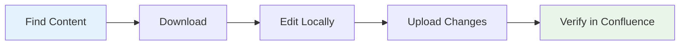
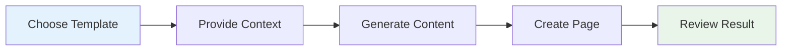
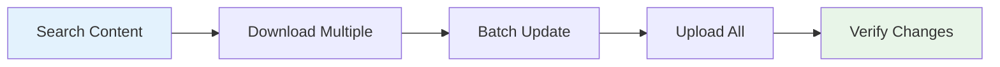

# Quick Start Guide

Get up and running with the MCP Confluence ADF server in minutes.

## Prerequisites

- **Node.js 18+** installed on your system
- **Claude Code** installed and configured
- **Confluence Cloud** instance (not Server/Data Center)
- **Atlassian Account** with admin access

## 5-Minute Setup

### Step 1: Install the MCP Server

Choose your preferred installation method:

**Option A: NPX (Recommended for testing)**
```bash
npx mcp-confluence-adf --help
```

**Option B: Global Installation**
```bash
# Using yarn
yarn global add mcp-confluence-adf

# Using npm  
npm install -g mcp-confluence-adf
```

### Step 2: Add to Claude Code

**Automatic Setup (Recommended):**
```bash
claude mcp add --scope user mcp-confluence-adf npx mcp-confluence-adf
```

**Manual Setup:**
Edit `~/.config/claude/settings.json`:
```json
{
  "mcp": {
    "servers": {
      "mcp-confluence-adf": {
        "command": "npx",
        "args": ["mcp-confluence-adf"]
      }
    }
  }
}
```

### Step 3: Restart Claude Code

Close and reopen Claude Code to load the MCP server.

### Step 4: Set Up Authentication

In Claude Code, say:
```
Set up OAuth authentication with my Confluence instance
```

Follow these steps:
1. **Provide OAuth Credentials** (get from [developer.atlassian.com](https://developer.atlassian.com))
2. **Authorize in Browser** (opens automatically)
3. **Confirm Success** (authentication complete)

### Step 5: Test Your Setup

Try these commands in Claude Code:

```
List my Confluence spaces
```

```
What Confluence tools do you have available?
```

If you see your spaces and available tools, you're ready to go!

## First Tasks

### Create Your First Page

```
Create a welcome page in my DOCS space with:
- A brief introduction
- Getting started steps  
- Contact information
```

### Download and Edit Existing Content

```
Download page 123456789 for editing
```

Then make your changes and:
```
Upload the updated content back to Confluence
```

### Generate Documentation from Templates

```
Generate API documentation using a template for my Payment Service
```

## Common Workflows

### 1. Content Management Workflow



**Example Commands:**
```
Search for pages about "authentication" in DOCS space
Download page "API Authentication Guide" 
Upload updated authentication guide
```

### 2. Template-Based Creation



**Example Commands:**
```
Show me available documentation templates
Generate user guide for mobile app using template
Create troubleshooting guide for payment service
```

### 3. Bulk Operations



**Example Commands:**
```
Find all API documentation pages
Update authentication sections in all API docs  
Upload all updated API documentation
```

## Essential Commands

### Content Operations

| Task | Command Example |
|------|-----------------|
| List spaces | `List my Confluence spaces` |
| Search content | `Find pages about "security" in DOCS space` |
| Download page | `Download page 123456789 to edit` |
| Create page | `Create a new page in DOCS space about API security` |
| Update page | `Update page 123456789 with new content` |

### Template Operations

| Task | Command Example |
|------|-----------------|
| List templates | `Show available documentation templates` |
| Generate from template | `Create API docs using REST API template` |
| Custom template | `Help me create a custom security audit template` |

### Authentication Operations

| Task | Command Example |
|------|-----------------|
| Check status | `Check my Confluence authentication status` |
| Reset auth | `Clear Confluence authentication and set up again` |
| Test connection | `Test connection to my Confluence instance` |

## Troubleshooting Quick Fixes

### MCP Server Not Loading
```
Error: "MCP server mcp-confluence-adf not found"
```

**Fix:**
1. Verify installation: `npx mcp-confluence-adf --help`
2. Check Claude Code configuration
3. Restart Claude Code

### Authentication Issues
```
Error: "OAuth authentication required"  
```

**Fix:**
```
Clear Confluence authentication
Set up OAuth authentication with Confluence
```

### Permission Errors
```
Error: "Insufficient permissions"
```

**Fix:**
1. Check OAuth scopes in Developer Console
2. Verify Confluence space permissions
3. Re-authorize if needed

## Tips for Success

### Content Creation Best Practices

1. **Start with Templates**
   - Use existing templates for consistency
   - Customize templates for your needs
   - Create reusable templates for common docs

2. **Use Rich Content Elements**
   ```
   Create a troubleshooting guide with:
   - Warning panels for critical steps
   - Info panels for helpful tips
   - Code blocks for commands
   - Expandable sections for details
   ```

3. **Organize Content Logically**
   - Use clear heading hierarchy
   - Include table of contents for long docs
   - Link related pages together

### Workflow Optimization

1. **Batch Similar Operations**
   ```
   Download all API documentation pages
   Update authentication sections in batch
   Upload all updated pages together
   ```

2. **Use Search Effectively**
   ```
   Find pages modified in the last week
   Search for pages by specific author
   Filter by space and content type
   ```

3. **Leverage Templates**
   ```
   Generate release notes using template
   Create consistent API documentation
   Standardize troubleshooting guides
   ```

## What's Next?

### Learn More Advanced Features

- **[Template System](./template-system.md)** - Master documentation templates
- **[Authentication Setup](./authentication-setup.md)** - Advanced OAuth configuration
- **[Claude Code Integration](./claude-code-integration.md)** - Powerful workflow patterns

### Explore All Tools

```
What Confluence tools do you have available?
```

This shows all 20+ tools for:
- Content management
- Space administration  
- Search and discovery
- Template generation
- Authentication management

### Join the Community

- **GitHub Issues**: Report bugs and request features
- **Documentation**: Comprehensive guides and examples
- **Examples**: Sample workflows and templates

## Advanced Quick Start

### For Developers

If you're a developer looking to integrate MCP Confluence ADF into workflows:

```bash
# Install as dependency
yarn add mcp-confluence-adf

# Use in Node.js projects
const { McpServer } = require('mcp-confluence-adf');

# Create custom MCP server
node custom-server.js
```

### For Teams

Set up consistent documentation workflows:

1. **Standardize Templates**
   ```
   Create template for API documentation
   Create template for user guides
   Share templates across team
   ```

2. **Establish Workflows**
   ```
   Define content review process
   Set up automated documentation updates
   Create style guide compliance checks
   ```

3. **Monitor Content Quality**
   ```
   Review documentation completeness
   Check for outdated content
   Validate link integrity
   ```

## Support and Resources

### Getting Help

```
How do I create a custom template?
What's the difference between panels and expandables?
How do I handle authentication errors?
```

### Documentation Structure

```
docs/
├── quick-start-guide.md          ← You are here
├── installation-guide.md         ← Detailed setup
├── authentication-setup.md       ← OAuth configuration  
├── template-system.md           ← Template mastery
├── claude-code-integration.md   ← Advanced workflows
└── troubleshooting.md           ← Problem solving
```

### Additional Resources

- **[Installation Guide](./installation-guide.md)** - Complete setup instructions
- **[MCP Tools Reference](./mcp-tools-reference.md)** - All available tools
- **[Error Handling](./error-handling.md)** - Troubleshooting guide
- **[Best Practices](./claude-code-integration.md#best-practices)** - Tips and recommendations

## Success Checklist

**Installation Complete**
- [ ] MCP server installed
- [ ] Added to Claude Code configuration
- [ ] Claude Code restarted

**Authentication Working**  
- [ ] OAuth app created in Developer Console
- [ ] Authentication flow completed
- [ ] Can list Confluence spaces

**Basic Operations Tested**
- [ ] Can search for content
- [ ] Can download and edit pages
- [ ] Can create new pages
- [ ] Templates are working

**Ready for Advanced Usage**
- [ ] Understand available tools
- [ ] Know how to troubleshoot issues
- [ ] Ready to explore advanced workflows

**Congratulations!** You're ready to streamline your Confluence documentation workflow with Claude Code and the MCP Confluence ADF server.

Start with simple tasks and gradually explore more advanced features. The system is designed to grow with your needs, from basic content management to sophisticated automated documentation workflows.