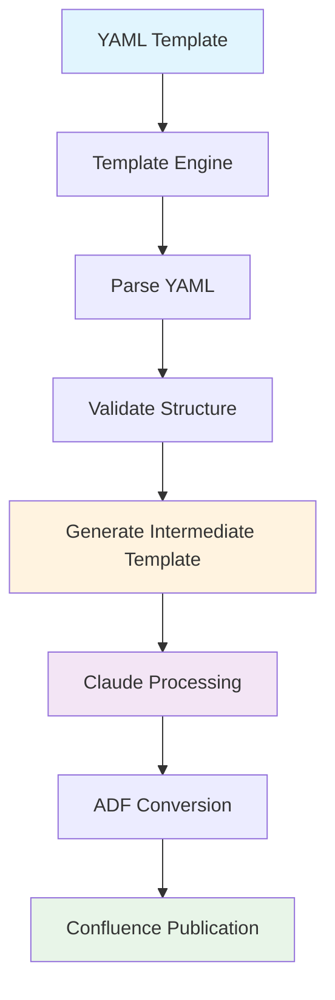
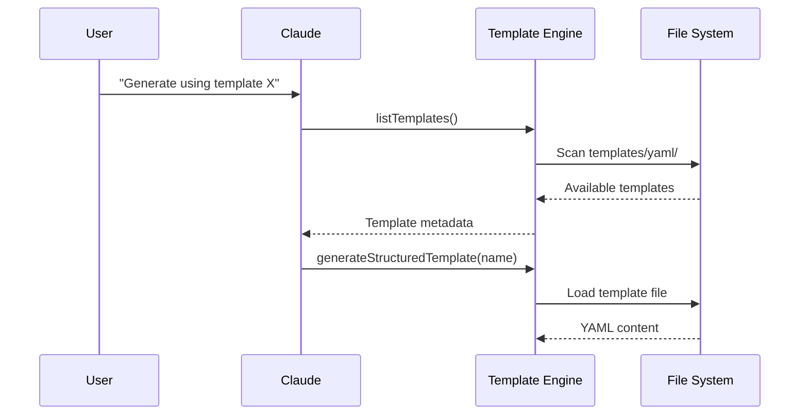
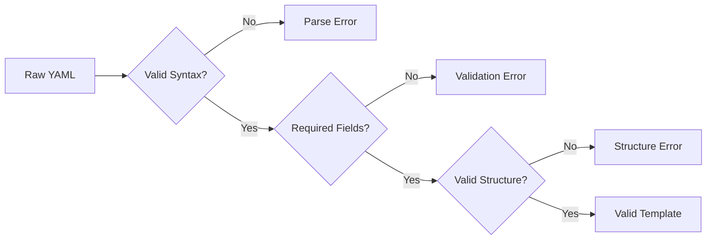
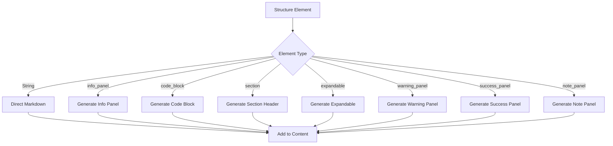
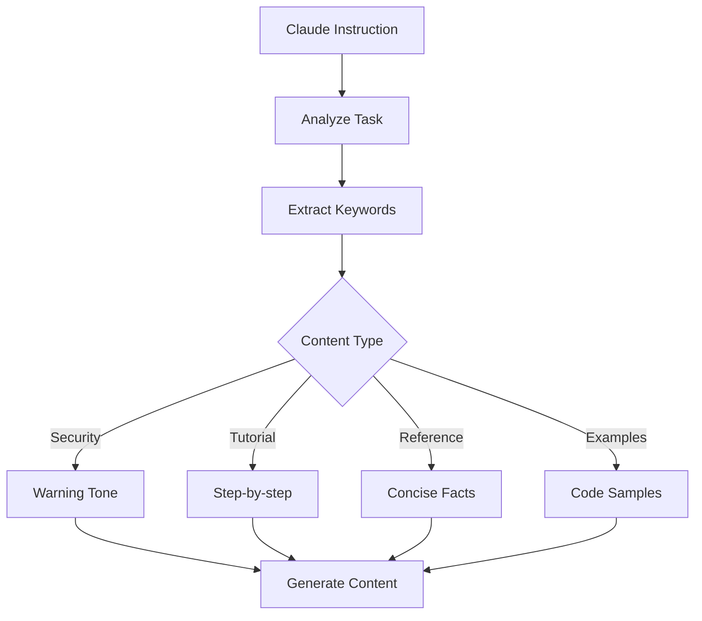
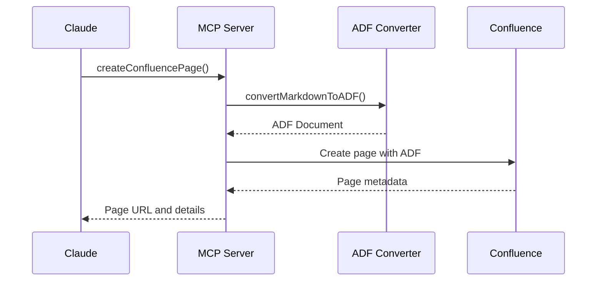
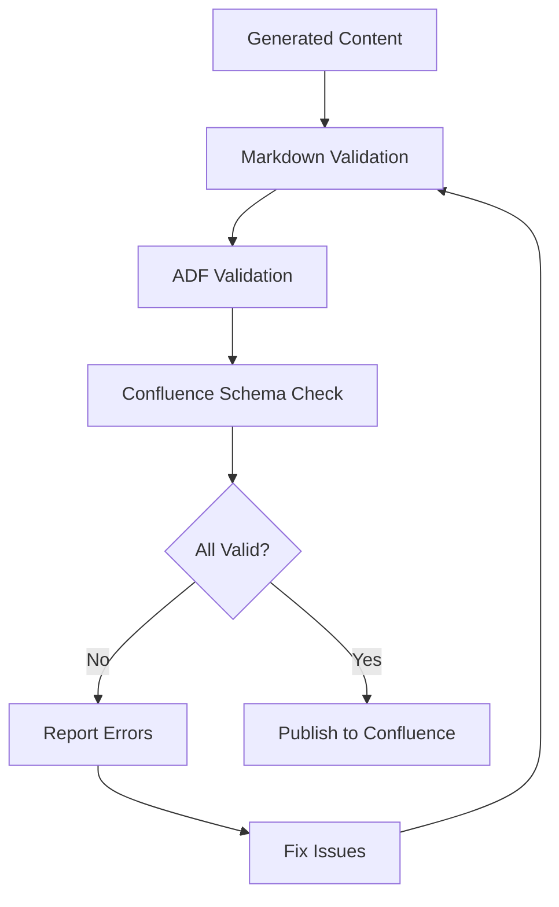
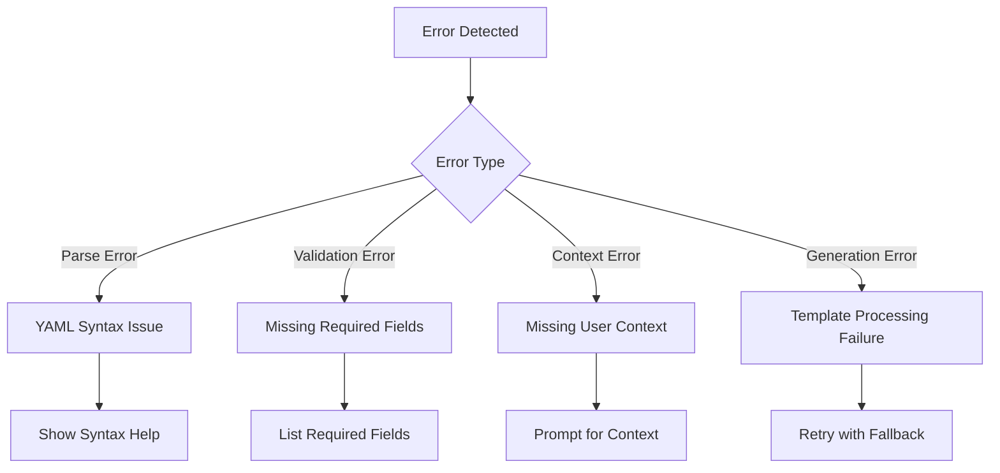
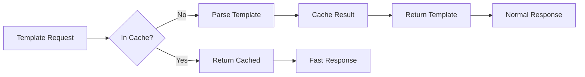
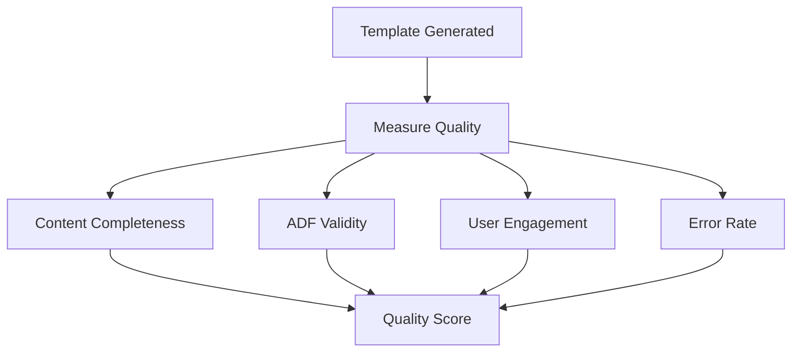

# Template Process Flow

Understanding the complete template generation and processing workflow in the MCP Confluence ADF system.

## Process Overview

The template system employs a sophisticated two-phase approach that separates content structure definition from content generation, enabling consistent, high-quality documentation while leveraging Claude's natural language capabilities.



## Phase 1: YAML to Intermediate Template

### 1. Template Discovery and Loading



**Template Discovery Process:**

1. **Directory Scan**: Engine scans `templates/yaml/` directory
2. **File Validation**: Checks for `.yml` and `.yaml` extensions  
3. **Metadata Extraction**: Parses frontmatter to extract template info
4. **Categorization**: Groups templates by category and sections

**Example Directory Structure:**
```
templates/yaml/
├── api-documentation-modular.yml
├── quick-start-guide.yml  
├── technical-specification.yml
└── user-guide-basic.yml
```

### 2. YAML Parsing and Validation

```typescript
interface TemplateStructure {
  metadata: {
    name: string;
    description: string;
    version: string;
    category: string;
    sections?: string[];
    output_type?: string;
  };
  user_context_required?: Record<string, string>;
  structure: Array<string | StructureElement>;
}
```

**Parsing Steps:**

1. **Frontmatter Extraction**: Split YAML frontmatter from structure
2. **Schema Validation**: Validate against Zod schema
3. **Structure Processing**: Parse structure array elements
4. **Context Validation**: Verify user context requirements
5. **Reference Resolution**: Resolve any module references

**Validation Checks:**



### 3. Intermediate Template Generation

The template engine converts YAML structure into an intermediate Markdown template with Claude instructions.

**Generation Algorithm:**

```typescript
function generateStructuredTemplate(templateName: string, userContext?: Record<string, any>) {
  // 1. Load and parse template
  const template = parseTemplate(templatePath);
  
  // 2. Validate template structure
  const validation = validateTemplate(template);
  
  // 3. Generate header with metadata
  let content = generateTemplateHeader(template.metadata);
  
  // 4. Add user context section if required
  if (template.user_context_required) {
    content += generateUserContextSection(template.user_context_required);
  }
  
  // 5. Process each structure element
  for (const element of template.structure) {
    content += processStructureElement(element, userContext);
  }
  
  // 6. Return result with validation info
  return {
    content,
    validation,
    templatePath,
    metadata: template.metadata
  };
}
```

**Element Processing:**



### 4. Template Header Generation

Every intermediate template includes comprehensive metadata:

```markdown
<!-- INTERMEDIATE TEMPLATE - FOR CLAUDE PROCESSING -->
<!-- Template: Template Name v1.0.0 -->
<!-- Category: user-guide -->
<!-- Sections: introduction, setup, examples -->
<!-- Generated: 2024-01-15T10:30:00Z -->
<!-- User Context Required: -->
<!-- project_name: What is your project name? -->
<!-- api_version: What API version are you documenting? -->
```

**Header Components:**

1. **Processing Flag**: Identifies intermediate template
2. **Template Metadata**: Name, version, category
3. **Generation Info**: Timestamp and context
4. **User Context**: Required variables and prompts
5. **Instructions**: How Claude should process the template

## Phase 2: Claude Processing

### 1. Instruction Recognition and Processing

Claude processes intermediate templates by recognizing and acting on instruction comments:

```markdown
<!-- CLAUDE INSTRUCTION: REPLACE THIS COMMENT WITH CONTENT -->
<!-- TASK: Provide step-by-step installation instructions -->
<!-- PURPOSE: Help users get the service running quickly -->
<!-- ADF FORMATTING OPTIONS: -->
<!-- Code blocks with ```bash, ```javascript, ```json -->
<!-- Panels: ~~~panel type=info title="Installation Notes" -->
```

**Processing Algorithm:**

1. **Scan for Instructions**: Find `<!-- CLAUDE INSTRUCTION -->` comments
2. **Extract Context**: Read TASK, PURPOSE, and formatting options
3. **Generate Content**: Create appropriate content based on instructions
4. **Replace Comments**: Substitute instruction comments with generated content
5. **Maintain Format**: Preserve Markdown structure and ADF compatibility

### 2. Content Generation Strategies

**Context-Aware Generation:**



**Example Processing:**

**Input (Intermediate):**
```markdown
> **Authentication Overview**
<!-- CLAUDE INSTRUCTION: REPLACE THIS COMMENT WITH CONTENT -->
<!-- TASK: Explain API key authentication for Payment API -->
<!-- PURPOSE: Help developers understand security requirements -->
```

**Output (Processed):**
```markdown
> **Authentication Overview**
The Payment API uses API key authentication for secure access. Every request must include a valid API key in the Authorization header. API keys are unique to each application and provide access control and request tracking capabilities.
```

### 3. ADF Formatting Intelligence

Claude applies intelligent ADF formatting based on content context:

**Security Content → Warning Panels:**
```markdown
<!-- Input -->
<!-- TASK: Document security considerations -->

<!-- Output -->  
> **Security Notice**
Never expose API keys in client-side code. Store keys securely in environment variables and rotate them regularly.
```

**Code Content → Code Blocks:**
```markdown
<!-- Input -->
<!-- TASK: Show installation command -->

<!-- Output -->
```bash
npm install payment-api-sdk
```

**Complex Content → Expandables:**
```markdown
<!-- Input -->
<!-- TASK: Document advanced configuration options -->

<!-- Output -->
<details>
<summary><strong>Advanced Configuration</strong></summary>

Configure custom timeout values, retry policies, and error handling:

```javascript
const config = {
  timeout: 30000,
  retries: 3,
  backoff: 'exponential'
};
```
</details>
```

## Phase 3: ADF Conversion and Publication

### 1. Markdown to ADF Conversion



**Conversion Process:**

1. **Parse Markdown**: Extract structure and formatting
2. **Convert Elements**: Transform Markdown to ADF nodes
3. **Preserve Formatting**: Maintain panels, code blocks, expandables
4. **Validate ADF**: Ensure valid ADF document structure
5. **Submit to Confluence**: Create or update page

**ADF Node Mapping:**

```typescript
const markdownToADFMapping = {
  '> **Title**': 'panel[info]',
  '> **Title**': 'panel[warning]', 
  '> **Title**': 'panel[success]',
  '> **Title**': 'panel[note]',
  '```language': 'codeBlock',
  '<details>': 'expand',
  '# Header': 'heading[1]',
  '## Header': 'heading[2]'
};
```

### 2. Quality Assurance and Validation

**Multi-Layer Validation:**



**Validation Layers:**

1. **Markdown Syntax**: Valid Markdown structure
2. **ADF Compatibility**: Convertible to ADF format
3. **Confluence Schema**: Meets Confluence requirements
4. **Content Quality**: Complete and coherent content
5. **User Experience**: Readable and useful documentation

## Error Handling and Recovery

### 1. Template Processing Errors



**Error Recovery Strategies:**

1. **Graceful Degradation**: Continue processing with warnings
2. **User Guidance**: Provide specific error messages and solutions
3. **Fallback Templates**: Use simpler templates when complex ones fail
4. **Partial Success**: Generate what's possible, report what failed

### 2. Content Generation Errors

**Handling Claude Processing Issues:**

```typescript
function handleContentGenerationError(error: Error, context: ProcessingContext) {
  if (error.type === 'CONTEXT_MISSING') {
    return promptForRequiredContext(context.userContextRequired);
  }
  
  if (error.type === 'INSTRUCTION_UNCLEAR') {
    return generateFallbackContent(context.task, context.purpose);
  }
  
  if (error.type === 'ADF_INCOMPATIBLE') {
    return convertToCompatibleFormat(context.content);
  }
  
  // Default: provide helpful error message
  return generateErrorGuidance(error, context);
}
```

## Performance Optimizations

### 1. Template Caching



**Caching Strategy:**

1. **Template Metadata**: Cache parsed frontmatter
2. **Validation Results**: Cache validation outcomes
3. **Generated Templates**: Cache intermediate templates
4. **User Context**: Cache user-provided context
5. **TTL Management**: Expire cache when templates change

### 2. Parallel Processing

```typescript
async function processMultipleTemplates(templateNames: string[]) {
  // Process templates in parallel
  const results = await Promise.allSettled(
    templateNames.map(name => generateStructuredTemplate(name))
  );
  
  // Handle results and errors separately
  const successes = results.filter(r => r.status === 'fulfilled');
  const failures = results.filter(r => r.status === 'rejected');
  
  return { successes, failures };
}
```

## Monitoring and Analytics

### 1. Template Usage Metrics

```typescript
interface TemplateMetrics {
  templateName: string;
  usageCount: number;
  successRate: number;
  averageProcessingTime: number;
  commonErrors: string[];
  userSatisfaction: number;
}
```

### 2. Quality Metrics



**Quality Indicators:**

1. **Content Completeness**: All instructions processed
2. **ADF Validity**: Clean conversion to ADF
3. **User Engagement**: Page views and interactions
4. **Error Rate**: Processing failures and user-reported issues
5. **Template Effectiveness**: Successful documentation outcomes

## Integration Points

### 1. MCP Server Integration

```typescript
// Template tools exposed via MCP
const templateTools = [
  'list_available_templates',     // Discovery
  'generate_from_template',       // Generation
  'validate_template',           // Quality assurance
  'create_custom_template',      // Extensibility
];
```

### 2. Confluence Integration

```typescript
// Confluence operations
const confluenceIntegration = {
  createPage: async (content: string, spaceId: string) => {
    const adf = await convertMarkdownToADF(content);
    return await confluenceAPI.createPage({ spaceId, body: adf });
  },
  
  updatePage: async (pageId: string, content: string) => {
    const adf = await convertMarkdownToADF(content);
    return await confluenceAPI.updatePage({ pageId, body: adf });
  }
};
```

### 3. Claude Code Integration

The template system seamlessly integrates with Claude Code workflows:

1. **Natural Language Commands**: Users request templates conversationally
2. **Context Awareness**: Claude understands project context
3. **Iterative Refinement**: Users can refine generated content
4. **Batch Operations**: Process multiple templates simultaneously
5. **Quality Assurance**: Claude validates and improves content

## Future Enhancements

### 1. Machine Learning Integration

- **Template Recommendation**: Suggest templates based on project type
- **Content Optimization**: Learn from successful documentation patterns  
- **Error Prevention**: Predict and prevent common template issues
- **User Personalization**: Adapt templates to user preferences

### 2. Advanced Features

- **Template Inheritance**: Base templates with specializations
- **Conditional Logic**: Dynamic template structure based on context
- **Multi-language Support**: Templates for different programming languages
- **Integration Templates**: Pre-built templates for common tools and frameworks

## Troubleshooting Guide

### Common Issues and Solutions

1. **Template Not Found**: Check template name and directory structure
2. **YAML Parse Error**: Validate YAML syntax and frontmatter format
3. **Missing Context**: Provide required user context variables
4. **ADF Conversion Failure**: Check Markdown format and ADF compatibility
5. **Confluence Publication Error**: Verify permissions and network connectivity

### Debug Mode

Enable detailed logging for troubleshooting:

```
LOG_LEVEL=debug node mcp-server.js
```

This provides detailed information about:
- Template discovery and loading
- YAML parsing and validation
- Content generation steps
- ADF conversion process
- Confluence API interactions

## Best Practices Summary

1. **Template Design**: Clear instructions, logical structure, appropriate components
2. **Context Management**: Minimal required context, clear prompts
3. **Error Handling**: Graceful degradation, helpful error messages
4. **Performance**: Caching, parallel processing, efficient validation
5. **Quality**: Multi-layer validation, user feedback integration
6. **Maintenance**: Regular template updates, usage analytics, performance monitoring

## Next Steps

- **[Claude Template Generation](./claude-template-generation.md)** - User guide for generating templates
- **[Custom Templates](./custom-templates.md)** - Creating your own templates
- **[Template System](./template-system.md)** - Deep dive into template architecture
- **[ADF Conversion](./adf-conversion.md)** - Understanding ADF format conversion