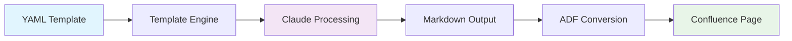

# Template System

Comprehensive guide to the MCP Confluence ADF template system for automated documentation generation.

## Overview

The template system provides a structured approach to generating consistent, high-quality documentation using YAML-based templates that are processed by Claude AI to create rich Confluence content.



## Template Architecture

### Two-Phase Processing

The system uses a two-phase approach:

1. **Phase 1: YAML to Intermediate Template**
   - Parse YAML structure and metadata
   - Generate intermediate Markdown with Claude instructions
   - Validate template structure and requirements

2. **Phase 2: Claude Processing to Final Content**
   - Claude processes instruction comments
   - Generates contextual content based on user input
   - Maintains ADF-compatible formatting

### Template Components

#### YAML Frontmatter
```yaml
---
name: "API Documentation"
description: "Complete API documentation with endpoints and examples"
version: "1.0.0"
category: "developer-resources"
sections: ["authentication", "endpoints", "examples"]
output_type: "confluence_page"
---
```

#### User Context Requirements
```yaml
user_context_required:
  service_name: "What is the name of your service?"
  base_url: "What is the API base URL?"
  version: "What version are you documenting?"
```

#### Structure Definition
```yaml
structure:
  - "# ${service_name} API Documentation"
  - type: "info_panel"
    title: "API Overview"
    content: "<!-- CLAUDE INSTRUCTION: Provide API overview -->"
  - "## Authentication"
  - type: "code_block"
    language: "bash"
    content: "curl -H 'Authorization: Bearer TOKEN' ${base_url}"
```

## Template Types and Use Cases

### 1. API Documentation Templates
- **Purpose**: Document REST APIs, GraphQL APIs, and service interfaces
- **Includes**: Authentication, endpoints, request/response examples, error codes
- **Best for**: Developer-facing documentation

### 2. User Guide Templates
- **Purpose**: Step-by-step guides for end users
- **Includes**: Getting started, tutorials, troubleshooting
- **Best for**: Customer-facing documentation

### 3. Technical Specification Templates
- **Purpose**: Detailed technical specifications and architecture
- **Includes**: System design, data models, integration patterns
- **Best for**: Internal technical teams

### 4. Quick Start Templates
- **Purpose**: Rapid onboarding and initial setup
- **Includes**: Installation, basic configuration, first steps
- **Best for**: New user onboarding

## Template Creation Workflow

### 1. Design Phase

**Identify Documentation Needs:**
```
- What type of content needs to be generated?
- Who is the target audience?
- What information will vary between uses?
- What structure should be consistent?
```

**Plan Template Structure:**
- Define sections and organization
- Identify reusable components
- Plan ADF elements (panels, code blocks, etc.)
- Determine user context requirements

### 2. Development Phase

**Create YAML Template:**
```yaml
---
name: "Your Template Name"
description: "Clear description of purpose"
version: "1.0.0"
category: "appropriate-category"
sections: ["list", "of", "sections"]
---

user_context_required:
  key1: "What information is needed?"
  key2: "Another required input?"

structure:
  - "# Title with ${key1}"
  - type: "info_panel"
    title: "Important Information"
    content: "<!-- CLAUDE INSTRUCTION: Generate relevant content -->"
```

**Test and Validate:**
- Use template generation tools
- Test with different user contexts
- Validate ADF conversion
- Review generated content quality

### 3. Deployment Phase

**Template Registration:**
- Save in `templates/yaml/` directory
- Ensure proper naming convention
- Update template discovery system
- Document template usage

## Advanced Template Features

### Conditional Content

Templates can include conditional logic based on user context:

```yaml
structure:
  - type: "conditional"
    condition: "${has_authentication}"
    content:
      - "## Authentication"
      - type: "warning_panel"
        title: "Security Notice"
        content: "<!-- CLAUDE INSTRUCTION: Security best practices -->"
```

### Component Reuse

Templates support component references for reusable elements:

```yaml
structure:
  - type: "component_ref"
    name: "standard_header"
    params:
      title: "${service_name}"
      version: "${version}"
```

### Dynamic Sections

Generate sections based on user context:

```yaml
structure:
  - type: "dynamic_sections"
    source: "${endpoints}"
    template:
      - "## ${endpoint.name}"
      - type: "code_block"
        language: "http"
        content: "${endpoint.method} ${endpoint.path}"
```

## Template Components Reference

### Basic Elements

#### Headers and Text
```yaml
structure:
  - "# Main Header"
  - "## Sub Header"  
  - "Regular paragraph text with ${variable} substitution"
```

#### Info Panels
```yaml
structure:
  - type: "info_panel"
    title: "Panel Title"
    content: "<!-- CLAUDE INSTRUCTION: Generate info content -->"
```

#### Warning Panels
```yaml
structure:
  - type: "warning_panel" 
    title: "Important Warning"
    content: "<!-- CLAUDE INSTRUCTION: Generate warning content -->"
```

#### Success Panels
```yaml
structure:
  - type: "success_panel"
    title: "Success Message"
    content: "<!-- CLAUDE INSTRUCTION: Generate success content -->"
```

#### Note Panels
```yaml
structure:
  - type: "note_panel"
    title: "Additional Notes"
    content: "<!-- CLAUDE INSTRUCTION: Generate note content -->"
```

### Advanced Elements

#### Code Blocks
```yaml
structure:
  - type: "code_block"
    language: "javascript"
    title: "Example Code"
    content: |
      function example() {
        // Generated by Claude
        return "${api_response}";
      }
```

#### Expandable Sections
```yaml
structure:
  - type: "expandable"
    title: "Advanced Configuration"
    content:
      - "<!-- CLAUDE INSTRUCTION: Detailed configuration options -->"
      - type: "code_block"
        language: "json"
        content: "{ \"config\": \"${config_example}\" }"
```

#### Tables
```yaml
structure:
  - type: "table"
    headers: ["Parameter", "Type", "Description"]
    content: "<!-- CLAUDE INSTRUCTION: Generate parameter table -->"
```

## Claude Instructions

### Instruction Format

Claude instructions are embedded as comments in the intermediate template:

```markdown
<!-- CLAUDE INSTRUCTION: REPLACE THIS COMMENT WITH CONTENT -->
<!-- TASK: Explain the authentication process -->
<!-- PURPOSE: Help developers integrate with the API -->
<!-- CONTEXT: service_name=${service_name}, auth_type=${auth_type} -->
<!-- ADF FORMATTING OPTIONS: -->
<!-- - Use code blocks for examples -->
<!-- - Use warning panels for security notes -->
<!-- - Use info panels for helpful tips -->
```

### Content Generation Guidelines

**Task Definition:**
- Clear, specific instructions for content generation
- Include relevant context variables
- Specify expected content type and length

**Purpose Clarity:**
- Explain why the content is needed
- Define the target audience
- Outline user expectations

**Formatting Instructions:**
- Specify ADF components to use
- Include formatting preferences
- Define code block languages and panel types

### Example Instructions

#### API Endpoint Documentation
```markdown
<!-- CLAUDE INSTRUCTION: REPLACE THIS COMMENT WITH CONTENT -->
<!-- TASK: Document the ${endpoint_name} endpoint -->
<!-- PURPOSE: Help developers understand request/response format -->
<!-- CONTEXT: method=${http_method}, path=${endpoint_path} -->
<!-- ADF FORMATTING OPTIONS: -->
<!-- - HTTP request in bash code block -->
<!-- - JSON response in json code block -->
<!-- - Parameter table with descriptions -->
<!-- - Error codes in warning panels -->
```

#### Security Guidelines
```markdown
<!-- CLAUDE INSTRUCTION: REPLACE THIS COMMENT WITH CONTENT -->
<!-- TASK: Provide security best practices for ${service_name} -->
<!-- PURPOSE: Ensure secure implementation -->
<!-- CONTEXT: auth_method=${auth_method}, sensitive_data=${data_types} -->
<!-- ADF FORMATTING OPTIONS: -->
<!-- - Critical security info in warning panels -->
<!-- - Code examples in code blocks -->
<!-- - Checklist format for verification steps -->
```

## Template Management

### Organization and Discovery

**Directory Structure:**
```
templates/
├── yaml/
│   ├── api-documentation.yml
│   ├── user-guide-basic.yml
│   └── technical-specification.yml
├── components/
│   ├── standard-header.yml
│   └── security-notice.yml
└── examples/
    ├── completed-api-doc.md
    └── sample-user-guide.md
```

**Template Metadata:**
- Name and description for discovery
- Version for tracking changes
- Category for organization
- Sections for filtering
- Author and maintenance info

### Version Control

**Template Versioning:**
```yaml
---
name: "API Documentation"
version: "2.1.0"
changelog:
  - "2.1.0: Added GraphQL support"
  - "2.0.0: Restructured sections"
  - "1.0.0: Initial version"
---
```

**Backward Compatibility:**
- Maintain compatibility with existing user contexts
- Provide migration guides for breaking changes
- Version deprecation notices

### Quality Assurance

**Template Validation:**
- YAML syntax validation
- Schema compliance checking
- Required field verification
- Component reference validation

**Content Quality:**
- Generated content review
- ADF conversion testing
- User context validation
- Documentation accuracy

## Integration with MCP Tools

### Template Discovery

Use MCP tools to discover available templates:

```
List all available documentation templates
```

**Expected Response:**
```
Available Templates (12 templates)
├── API Documentation (3 templates)
│   ├── REST API Documentation v2.1.0
│   ├── GraphQL API Guide v1.0.0
│   └── Microservice API v1.5.0
├── User Guides (4 templates)  
│   ├── Basic User Guide v1.2.0
│   ├── Advanced User Guide v1.0.0
│   ├── Mobile App Guide v2.0.0
│   └── Web Application Guide v1.1.0
└── Technical Documentation (5 templates)
    ├── Technical Specification v1.0.0
    ├── Architecture Overview v2.0.0
    ├── Integration Guide v1.3.0
    ├── Troubleshooting Guide v1.1.0
    └── Security Documentation v1.0.0
```

### Template Generation

Generate content using templates:

```
Generate API documentation using the REST API template for PaymentService
```

**Interactive Context Collection:**
```
I'll help you generate API documentation. I need some information:
- Service name: PaymentService
- Base URL: https://api.example.com/v1
- Authentication method: API Key
- Version: 1.0.0

Generating comprehensive API documentation...
```

### Custom Template Creation

Create new templates through natural conversation:

```
Help me create a custom template for security audit documentation
```

**Claude Response:**
```
I'll help you create a security audit template. Let me gather requirements:

1. What sections should be included?
   - Executive Summary
   - Scope and Methodology
   - Findings and Risks
   - Recommendations
   - Compliance Status

2. What user context is needed?
   - Audit date and auditor
   - System/application being audited
   - Compliance framework (SOC 2, ISO 27001, etc.)

Creating YAML template structure...
```

## Best Practices

### Template Design

**Structure Guidelines:**
- Start with overview/introduction
- Use logical section progression
- Include practical examples
- End with next steps or references

**Content Instructions:**
- Be specific in Claude instructions
- Provide sufficient context
- Include formatting preferences
- Define content scope and depth

**User Experience:**
- Minimize required user context
- Use clear, descriptive prompts
- Provide helpful defaults
- Validate user inputs

### Performance Optimization

**Template Efficiency:**
- Keep templates focused and modular
- Reuse common components
- Cache frequently used templates
- Optimize Claude instruction clarity

**Content Generation:**
- Use specific instructions for better results
- Provide adequate context for Claude
- Structure content logically
- Test with various user inputs

### Maintenance

**Regular Updates:**
- Review and update templates quarterly
- Gather user feedback for improvements
- Update examples and best practices
- Maintain compatibility across versions

**Quality Control:**
- Test template generation regularly
- Validate ADF conversion accuracy
- Monitor content quality metrics
- Address user-reported issues

## Troubleshooting

### Common Issues

#### Template Not Found
**Error:** `Template 'template-name' not found`
**Solution:** Verify template exists in templates/yaml/ directory

#### YAML Parse Error
**Error:** `Invalid YAML syntax in template`
**Solution:** Validate YAML formatting and structure

#### Missing User Context
**Error:** `Required context 'variable_name' not provided`
**Solution:** Provide all required user context variables

#### ADF Conversion Failure
**Error:** `Failed to convert generated content to ADF`
**Solution:** Check Markdown formatting and ADF compatibility

### Debug Mode

Enable detailed logging for troubleshooting:

```bash
LOG_LEVEL=debug node mcp-server.js
```

**Debug Information Includes:**
- Template discovery and loading
- YAML parsing steps
- Context variable substitution
- Claude instruction processing
- ADF conversion details

### Getting Help

**Built-in Help:**
```
How do I create a custom template?
What template components are available?
Show me examples of Claude instructions
```

**Community Resources:**
- Template examples repository
- Community-contributed templates
- Best practices documentation
- Issue tracking and support

## Advanced Topics

### Template Inheritance

Create base templates that can be extended:

```yaml
---
name: "Base Documentation Template"
type: "base"
---

base_structure:
  - type: "standard_header"
  - type: "overview_section"
  - type: "content_placeholder"
  - type: "standard_footer"
```

Extended template:
```yaml
---
name: "API Documentation"
extends: "base-documentation"
---

structure:
  - type: "inherit_base"
  - type: "override"
    section: "content_placeholder"
    content:
      - "## API Endpoints"
      - type: "endpoint_documentation"
```

### Dynamic Content Generation

Templates that adapt based on external data:

```yaml
structure:
  - type: "dynamic_content"
    source: "api_specification"
    generator: "openapi_parser"
    template: "endpoint_template"
```

### Multi-language Support

Templates supporting multiple programming languages:

```yaml
user_context_required:
  programming_language: "Which programming language? (javascript|python|java|go)"

structure:
  - type: "conditional_content"
    conditions:
      javascript: 
        - type: "code_block"
          language: "javascript"
          content: "const api = require('${service_name}-sdk');"
      python:
        - type: "code_block"
          language: "python"  
          content: "import ${service_name}_sdk"
```

## Next Steps

- **[Template Process Flow](./template-process-flow.md)** - Technical implementation details
- **[Claude Template Generation](./claude-template-generation.md)** - User guide for generating templates
- **[Custom Templates](./custom-templates.md)** - Creating your own templates
- **[ADF Conversion](./adf-conversion.md)** - Understanding ADF format conversion